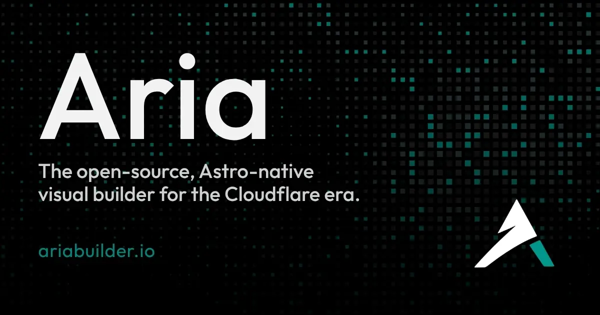

<p align="center">
  
</p>

<p align="center">
  <a href="LICENSE"></a>
  <a href="https://astro.build"></a>
  <a href="https://developers.cloudflare.com/workers/"></a>
  <a href="https://nodejs.org"></a>
</p>
<br>
<p align="center">
  <a href="https://deploy.workers.cloudflare.com/?url=https://github.com/ariabuilder/aria">
    
  </a>
</p>
<br />
<p align="center">An open alternative to WordPress plugins and Webflow lock-in:<br>Visual editing, a real CMS, and an AI engineer in Astro.</p>

<p align="center">
  <a href="#-quick-start">Quick start</a> ⌁
  <a href="#-choose-a-runtime">Runtimes</a> ⌁
  <a href="#-what-aria-includes">Capabilities</a> ⌁
  <a href="https://ariabuilder.io/docs/">Docs</a> ⌁
  <a href="#-contributing-and-support">Contributing</a>
</p>

---

### ✦ Quick start

Deploy Aria to Cloudflare in one click, or run it locally with Node and SQLite.

#### Deploy to Cloudflare

1. Click the **Deploy to Cloudflare** button above.
2. Accept the generated Worker, D1, KV, R2, Queue, Durable Object, and optional Workers AI resources. Give the two KV namespaces **distinct** titles (e.g. `aria-cache` and `aria-session`) — the form cannot prefill them.
3. Open `/admin/setup` on the live site, create the first administrator, and complete first-launch setup.

One-click runs the deploy script: migrate D1, build the Worker, bootstrap the
secrets Aria needs to boot (Site API keyring + OAuth), and ship it. You land on
a blank site — finish at `/admin/setup`. Redeploys keep your content and won't
rotate keys that are already live. Optional pieces (email encryption, Turnstile,
custom-domain analytics, webhooks) are deliberately configured after deployment
and never block first boot. See the
[Cloudflare deployment guide](https://ariabuilder.io/docs/deployment/cloudflare/)
for prerequisites and manual deploy.

The deployment template also declares a few bindings and triggers the Deploy button does
not list as generated resources — Cloudflare Images (media transforms degrade
gracefully without an entitlement), the Cache API, and a 5-minute cron
trigger. None of them block first boot.

**Workers Builds settings:** the Deploy flow auto-detects `build` and `deploy`
scripts from `package.json` and pre-fills both fields — keep the deploy
command as `npm run deploy` (it migrates D1, then builds). You can clear the
build command to skip a redundant second build; leaving it pre-filled is safe,
just slower. The default non-production deploy (`wrangler versions upload`)
skips migrations and secret bootstrap, so preview deploys can lag behind on
schema and secrets.

#### Optional Studio traffic metrics

The Deploy button cannot create a least-privileged Cloudflare API token or
choose a DNS zone for you. A new `workers.dev` URL does not belong to one of
your account's zones, so finish this setup after connecting a Cloudflare-managed
custom domain:

1. [Create a dedicated Zone Analytics token](https://dash.cloudflare.com/profile/api-tokens?permissionGroupKeys=%5B%7B%22key%22%3A%22analytics%22%2C%22type%22%3A%22read%22%7D%5D&accountId=%2A&zoneId=all&name=Aria%20Zone%20Analytics), restrict it to the site's zone, and grant **Zone → Analytics → Read**. **Zone → Zone → Read** is optional and only lets Aria verify that the configured zone matches the site domain.
2. Copy the domain's [Zone ID](https://developers.cloudflare.com/fundamentals/account/find-account-and-zone-ids/).
3. In **Workers & Pages → your Aria Worker → Settings → Variables and Secrets**, add `ARIA_CLOUDFLARE_ANALYTICS_TOKEN` as an encrypted secret and `ARIA_CLOUDFLARE_ZONE_ID` as a plain-text variable, then deploy the new Worker version.
4. Set Aria's **Site URL** to the custom-domain URL and enable **Show Cloudflare metrics in Aria Builder** under Analytics settings.

Existing deployments that use `ARIA_CLOUDFLARE_API_TOKEN` remain compatible,
but the dedicated analytics token is preferred because it can be limited to
read-only analytics access. Sites that stay on `workers.dev` can use
Cloudflare's Worker metrics dashboard instead.

#### Run locally

**Requirements:** Node.js `>= 22.18.0` and npm.

```bash
git clone https://github.com/ariabuilder/aria.git
cd aria
npm install
npm run dev
```

Open [http://localhost:4321/admin](http://localhost:4321/admin) and complete
first-run setup at `/admin/setup`.

For Cloudflare binding parity (D1, KV, R2, and Workers), run:

```bash
npm run dev:edge
```

[Local setup](https://ariabuilder.io/docs/getting-started/local-setup/) ·
[Edge development](https://ariabuilder.io/docs/getting-started/edge-dev/)

<br>

### ✦ Choose a runtime

<table>
  <thead>
    <tr>
      <th width="120"></th>
      <th>Cloudflare</th>
      <th>Node&nbsp;+&nbsp;SQLite</th>
    </tr>
  </thead>
  <tbody>
    <tr>
      <td><strong>Runs&nbsp;on</strong></td>
      <td>Workers with D1, KV, R2, Queues, Durable Objects, and optional Workers AI</td>
      <td>Your PC, VPS, Docker, Railway, or another Node host</td>
    </tr>
    <tr>
      <td><strong>Best&nbsp;for</strong></td>
      <td>Edge delivery and Cloudflare-native services</td>
      <td>Local development, self-hosting, and straightforward deployments</td>
    </tr>
    <tr>
      <td><strong>Start&nbsp;with</strong></td>
      <td><code>npm run dev:edge</code> locally; <code>npm run deploy</code> for production</td>
      <td><code>npm run dev</code></td>
    </tr>
  </tbody>
</table>

The same Astro project, Astro Actions, and `StorageAdapter` run in both modes.<br>See [storage and runtimes](https://ariabuilder.io/docs/concepts/storage-and-runtimes/)
for the architecture and trade-offs.

<br>

### ✦ What Aria Builder includes

<table>
  <thead>
    <tr>
      <th width="220">Capability</th>
      <th>What it enables</th>
    </tr>
  </thead>
  <tbody>
    <tr>
      <td><strong>Studio&nbsp;&amp;&nbsp;Composer</strong></td>
      <td>Edit the real page on a visual canvas, with Inspector controls, responsive viewports, and optimistic updates. <a href="https://ariabuilder.io/docs/tutorials/composer/">Explore Composer →</a></td>
    </tr>
    <tr>
      <td><strong>CMS&nbsp;&amp;&nbsp;collections</strong></td>
      <td>Define structured content, schemas, templates, relations, drafts, and revisions without a separate CMS product. <a href="https://ariabuilder.io/docs/tutorials/collections/">Explore collections →</a></td>
    </tr>
    <tr>
      <td><strong>Design&nbsp;system&nbsp;&amp;&nbsp;motion</strong></td>
      <td>Author tokens, semantic classes, fonts, and motion visually; publish only the CSS each page needs. <a href="https://ariabuilder.io/docs/concepts/design-system/">Design system →</a> <a href="https://ariabuilder.io/docs/tutorials/composer/motion/">Motion →</a></td>
    </tr>
    <tr>
      <td><strong>AI&nbsp;Engineer&nbsp;&amp;&nbsp;MCP</strong></td>
      <td>Plan, create, and publish with an agent and external tools that honor the same role permissions as Studio. <a href="https://ariabuilder.io/docs/creators/agent-and-mcp/">Explore Agent &amp; MCP →</a></td>
    </tr>
    <tr>
      <td><strong>Site&nbsp;API</strong></td>
      <td>Connect site-local automations through policy-aware REST endpoints for CMS collection and entry workflows. Site API credentials are scoped to the site and use Aria's authorization model.</td>
    </tr>
    <tr>
      <td><strong>Auth&nbsp;&amp;&nbsp;security</strong></td>
      <td>Use sessions, TOTP, roles, capabilities, audit logging, rate limiting, and login protection built into Aria. <a href="https://ariabuilder.io/docs/creators/auth/">Authentication →</a> <a href="https://ariabuilder.io/docs/tutorials/settings/security/">Security →</a></td>
    </tr>
    <tr>
      <td><strong>Email</strong></td>
      <td>Send password resets and transactional messages through Cloudflare Email, SMTP, or a local preview sink. <a href="https://ariabuilder.io/docs/creators/email/">Explore email →</a></td>
    </tr>
    <tr>
      <td><strong>SEO&nbsp;&amp;&nbsp;publishing</strong></td>
      <td>Publish with sitemaps, feeds, redirects, JSON-LD, crawler guidance, and site-health tools. <a href="https://ariabuilder.io/docs/tutorials/settings/seo/">SEO →</a> <a href="https://ariabuilder.io/docs/creators/publishing/">Publishing →</a></td>
    </tr>
    <tr>
      <td><strong>Runtime&nbsp;&amp;&nbsp;storage</strong></td>
      <td>Keep code portable while choosing SQLite locally or Cloudflare D1, KV, and R2 at the edge. <a href="https://ariabuilder.io/docs/concepts/storage-and-runtimes/">Storage and runtimes →</a></td>
    </tr>
    <tr>
      <td><strong>Ownership&nbsp;&amp;&nbsp;export</strong></td>
      <td>Download a clean Astro project, including your pages, components, design system, and CMS data. <a href="https://ariabuilder.io/docs/deployment/export-and-import/">Export and import →</a></td>
    </tr>
  </tbody>
</table>

<br>

### ✦ Why Aria exists

The job has not changed: ship a site, manage content, and iterate on design.<br>Aria Builder combines visual editing with an Astro codebase and a runtime you control.

<table>
  <thead>
    <tr>
      <th width="120"></th>
      <th>The&nbsp;old&nbsp;way</th>
      <th>Aria</th>
    </tr>
  </thead>
  <tbody>
    <tr>
      <td><strong>Foundation</strong></td>
      <td>Theme and plugin layers across several products</td>
      <td>One Astro project with Studio, content, design, and publishing</td>
    </tr>
    <tr>
      <td><strong>Content</strong></td>
      <td>A posts table plus add-ons</td>
      <td>Structured collections with schemas and visual templates</td>
    </tr>
    <tr>
      <td><strong>Design</strong></td>
      <td>Theme options that drift</td>
      <td>A canonical design system shared by previews, publishing, and export</td>
    </tr>
    <tr>
      <td><strong>AI</strong></td>
      <td>A disconnected chat sidebar</td>
      <td>An agent and MCP server with the same capabilities as a user</td>
    </tr>
    <tr>
      <td><strong>Ownership</strong></td>
      <td>Hosting and export restrictions</td>
      <td>A project you can run, deploy, and export yourself</td>
    </tr>
  </tbody>
</table>

<br>

### ✦ Ownership and architecture

Aria separates code deployment, schema migrations, and content promotion.<br>A builder update does not overwrite live pages or settings unless you
explicitly promote content.

The Studio export creates a clean Astro project you can take elsewhere. For
deployment, media storage, content promotion, and environment configuration,
use the [Cloudflare deployment guide](https://ariabuilder.io/docs/deployment/cloudflare/),
[content-sync guide](https://ariabuilder.io/docs/deployment/content-sync/), and
[environment-variable reference](https://ariabuilder.io/docs/reference/environment-variables/).

Technical details for contributors, including the generated inline-SVG icon
pipeline, are documented in the [platform architecture](https://ariabuilder.io/docs/contributors/architecture/platform/).

<br>

### ✦ Status and roadmap

Aria is pre-launch and under active development.

Webhook automation, third-party OAuth, Figma integration, and plugins
are not currently available and are currently being developed.

See [ROADMAP.md](ROADMAP.md) for publicly planned work.

<br>

### ✦ Documentation

Start with [Aria docs](https://ariabuilder.io/docs/) for setup,
deployment, Studio workflows, and contributor architecture.

Documentation will be expanded on as we progress with development. Expect full step by step guides, video tutorials, and more.

<table>
  <thead>
    <tr>
      <th width="160">Resource</th>
      <th>What it covers</th>
    </tr>
  </thead>
  <tbody>
    <tr>
      <td><a href="https://ariabuilder.io/docs/deployment/cloudflare/">Deployment</a></td>
      <td>Cloudflare setup, migrations, bindings, and content after deploy</td>
    </tr>
    <tr>
      <td><a href="https://ariabuilder.io/docs/contributors/">Architecture</a></td>
      <td>Platform boundaries and extension points</td>
    </tr>
    <tr>
      <td><a href="SECURITY.md">SECURITY.md</a></td>
      <td>Private vulnerability reporting</td>
    </tr>
    <tr>
      <td><a href="TRADEMARKS.md">TRADEMARKS.md</a></td>
      <td>Name, logo, and fork-branding rules</td>
    </tr>
  </tbody>
</table>

<br>

### ✦ Contributing and support

Contributions are welcome, especially around Composer UX, blocks, and tests.
Read [CONTRIBUTING.md](CONTRIBUTING.md), review the
[contributor documentation](https://ariabuilder.io/docs/contributors/), and
open an issue before substantial architectural changes. Support expectations
are in [SUPPORT.md](SUPPORT.md).

Bundled front-end asset notices, including Outfit under the SIL OFL 1.1, are
listed in [Acknowledgements](acknowledgements.md).

**Built for creators.**

Apache-2.0 | See [LICENSE](LICENSE) | [Trademarks](TRADEMARKS.md) | [Acknowledgements](acknowledgements.md)
